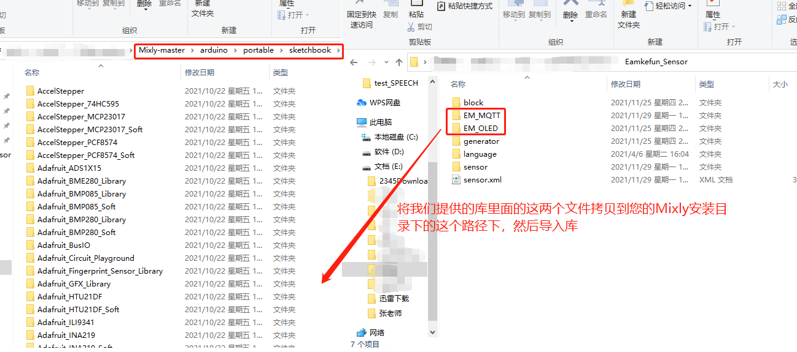
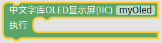
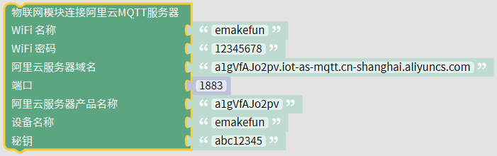
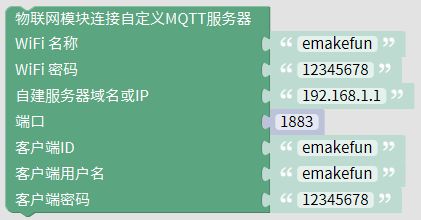
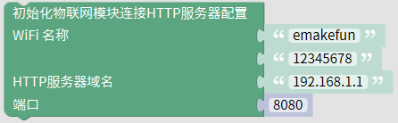

# Emakefun_sensors_graphical_lib
​       本库是深圳市易创空间科技有限公司结合自家公司生产的硬件做的Arduino库；其中里面包含Arduino源码、Mixly扩展库、Mind+扩展库、MBlock5扩展库以及相对应的示例程序。
## 目录结构

|---- emakefun_sensors_graphical_lib

    |----- README.md

    |----- example

    |     |----- mblock5
 
    |     |----- mind+

    |     |----- mixly

    |----- mblock5

    |----- media

    |     |----- mixly

    |----- mind+

    |----- mixly

## 库描述

### 一. Mixly库

​        mixly库我们秉着mixly软件自带传感器库和我们的硬件兼容的器件我们不做库，只做差异化的库的原则分成了六个模块，分别为基础输入模块、传感器、显示器、执行器、智能模块、无线通信；当我们使用Mixly编程的时候，先[点击下载](https://github.com/emakefun/emakefun_sensors_graphical_lib/releases/download/v1.0.0/Emakefun_Sensor.zip) Mixly库，解压下载的Emakefun_Sensor.zip文件；将里面的EM_MQTT和EM_OLED两个文件夹，复制粘贴到mixly安装目录下的arduino->portable->sketchbook->libraries文件夹下；然后再通过mixly导入本地库的操作导入EmakefunSensor.xml文件，如下图所示。

####  基础输入模块 

##### **钢琴模块**：

钢琴模块分为v1、v2两个版本，使用时请根据硬件上的丝印选择对应的块。

当硬件是V1时，请选择

**描述：** 
钢琴模块选择对应的CLK、DIO两个引脚，判断钢琴模块上的数字按键是否被触摸；当被触摸对应的数字时，输出TRUE,否则为FALSE。

[Mixly钢琴模块V1案例下载](./example/mixly/piano_v1_mixly.mix)

**案例说明**：钢琴V1模块CLK引脚接Arduino的A4引脚，钢琴模块的DIO引脚接Arduino的A5引脚，无源蜂鸣器的S引脚接Arduino的3引脚；当按下钢琴模块不同的数字按钮，无源蜂鸣器发出不同的音符，犹如我们在弹钢琴，如果觉得音质不对，我们可以自己调节无源蜂鸣器的频率，让蜂鸣器发出想要的声音，这里就不做过多的解释。 

当硬件是V2时，请选择

说明和V1相同操作。

[Mixly钢琴模块V2案例下载](./example/mixly/piano_v2_mixly.mix )

##### **旋转编码器**

旋转编码器分为初始化块、获取旋转编码值、获取旋转编码器的按键值三个图形化块。

**描述：**

初始化块：  初始化指定旋转编码器的三个引脚,并定义我们自己的旋转编码器对象myEncoder.

获取旋转编码器的编码值：  获取旋转编码器myEncoder的编码值

获取旋转编码器的按键值：  旋转编码器按下为一个按键，该块可以获取该旋转编码器的按键的状态值，按下为TRUE, 不按为FALSE。

[Mixly旋转编码器案例下载](./example/mixly/encoder_mixly.mix)

**案例说明：** 旋转编码器A引脚连接Arduino的3引脚，旋转编码器的B引脚连接Arduino的5引脚，旋转编码器的D引脚，当旋转编码器按下的时候，串口显示“encoder button is Enter”，当旋转旋转编码器的时候，串口显示不同的数值。

##### **矩阵键盘**

矩阵键盘也可以分成两种，一种是常见的插针式八个引脚，一种是四线的两线串行PH2.0接口的；这里我们只做了两线串行的PH2.0的矩阵键盘。

**描述：**

初始化块： 初始化矩阵键盘对象myMatrixKeyboard,并且指定SCL和SDO引脚。

获取矩阵键盘按下的值：获取按下的键盘值。

[MixlyPH2.0矩阵键盘案例下载](./example/mixly/matrixKeyboard_mixly.mix)

**案例说明：**P H2.0矩阵键盘的SCL引脚接Arduino的A5引脚，SDO引脚接Arduino的A4引脚，当触摸PH2.0矩阵键盘的按键时，串口打印对应的按键值；不触摸，则串口打印空行。

##### **PH2.0小手柄**

这款小手柄是我们公司根据市场需求自主研发的一款IIC通信的手柄，IIC通信地址为：**0x5A**，深受客户的喜爱。该手柄包含 两个电位器（X轴和Y轴）操纵杆(摇杆)和五个按键（A、B、C、D、摇杆按键Z）。 

**描述：**

获取遥杆的值： 小手柄分两个方向X、Y，遥感值的范围为0-255，当摇杆都不操作时，X,Y两个方向的值都是128；

获取手柄的按键状态： 小手柄的按键有五个(A\B\C\D\Z)，状态又可以分为五种( 按下、释放、单击、双击、长按 、未按)； 长按：一直按着按钮3s以上；

[Mixly PH2.0小手柄案例](./example/mixly/joystickhande_mixly.mix)

**案例说明：** PH2.0小手柄接Arduino的IIC接口，SDA接Arduino的A4,SCL接Arduino的A5;串口会一直打印小手柄的遥杆X 、Y轴方向的值和按钮A的状态。

#### 传感器

##### RGB超声波

RGB超声波模块是易创空间公司自研的一款彩灯和测距的双功能传感器。

**描述：**

初始化块： 初始化RGB超声波，并且选择超声波IO引脚和RGB引脚；

设置RGB超声波模块RGB的显示状态： 显示状态包括亮灯数量、颜色和灯亮的样式，都可以通过该块来设置；

获取距离： 获取RGB超声波读取到的距离，单位厘米(cm);

[Mixly RGB超声波案例](./example/mixly/rgbUltrasonic_mixly.mix)

**案例说明：** RGB超声波模块超声波引脚(io)连接Arduino的6引脚，RGB引脚连接Arduino的5引脚；设置了两个探头都亮红色，样式无；并串口打印获取到的距离。

##### **指南针模块**

指南针模块通信方式是IIC，地址为：**0x0D**

**描述：**

获取选取的方向的值： 获取某个方向的度数

[Mixly 指南针模块案例](./example/mixly/compass_mixly.mix)

**案例说明：** 指南针模块接Arduino的IIC接口，SDA接Arduino的A4,SCL接Arduino的A5;串口会打印出模块获取X方向的度数。

##### 五路循迹模块

该模块是我们公司通过结合广大创客爱好者提供的需求，研发的一款循迹模块，它能够更好、更方便的控制循迹小车，该模块通过IIC通信，地址为：**0x50**

**描述：**

五路循迹模块获取单路探头： 选择对应的探头，当该探头检测到黑线时，输出高电平，否则输出低电平；

五路循迹模块获取状态值： 获取五个探头的状态，每一位代表一个探头，比如当返回值为0x01时，代表第一组探头检测到黑线，当返回值为0x03时，代表第一第二组探头都检测到了黑线(探头从左至右)。

[Mixly 五路循迹模块案例](./example/mixly/fix_track_mixly.mix)

**案例说明：** 五路循迹模块接Arduino的IIC接口，SDA接Arduino的A4,SCL接Arduino的A5;当第一组探头检测到黑线时，打印模块获取到的状态值。

#### 显示器

##### 带中文字库OLED显示屏

该模块自带一个中文字库芯片，解决了广大爱好者想OLED显示中文的烦恼，同时也支持原有OLED的所有功能，简直不要太好用；该模块使用IIC通信，地址为： **0x3C**

**描述：**

OLED执行： 当需要OLED模块显示数据时，需要把显示的块放到该块中；

OLED对应坐标显示数据： 设置具体位置显示某个具体的字符串和字体大小；

OLED对应行显示数据： 设置具体的第几行显示某个具体的字符串和字体大小；

[Mixly 带中文字库OLED案例](./example/mixly/oled_mixly.mix)

**案例说明：** OLED模块通信使用IIC，所以需要接Arduino的IIC口，模块的SDA接Arduino的A4,SCL接Arduino的A5;

显示屏第一行显示"Hello Arduino!"，第二行显示"我爱创客"；

#### 执行器

##### 蜂鸣器

该模块和Mixly自带的蜂鸣器有所不同，该蜂鸣器库是不调用Arduino原底层的蜂鸣器而实现的；目的为了释放Arduino本身的定时器。

**描述：**

蜂鸣器块： 该模块可以设置蜂鸣器的引脚、频率和持续时间；

##### 双路电机驱动板

双路电机驱动板是我们公司自主设计的一款电机驱动模块，使用PWM控制，所以默认端口为5，6，9 ，10；驱动板虽然只有两路驱动，但是支持四个电机，适合做两驱小车。

**描述：**

 该模块电机M1和M2共用一路驱动，M3和M4共用一路，同时可以设置速度，当速度为负时，电机反转，为正时，电机正转；

#### 智能模块

##### **颜色传感器**

颜色传感器是可以分别检测出需要识别的颜色的R、G、B值，同时也可以伽马校正后的值；该传感器也是IIC通信，地址为：**0x29**；

**描述：**

获取颜色传感器的获取的颜色值

 通过获取到颜色值数据执行想要的操作；

**语音识别传感器**

 该语音识别模块是emakefun基于非特定人语音识别LD3320SI-ASR：（Speaker-Independent Automatic Speech Recognition）芯片开发的一款语音识别模块。LD3320芯片上集成了高精度的 A/D 和 D/A 接口，不再需要外接辅助的 Flash 和RAM，即可以实现语音识别/声控/人机对话功能。提供了真正的单芯片语音识别解决方案。 该模块有如下特点：  

- 非特定人语音识别技术 用户不需要进行录音训练即可动态编辑的识别关键词语列表，只需要把识别的关键词语以字符串的形式传送进芯片，即可以在下次识别中立即生效。
- 支持用户自由编辑50条关键词语条 在同一时刻，最多在50条关键词语中进行识别，终端用户可以根据场景需要，随时编辑和更新关键词语的内容，每条词条字数不超过79个。
- 模块上有蓝色状态灯，亮起表示正在识别语音，灭掉表示不会识别语音，当识别到语音时状态灯会变暗，或闪烁，等待读取后会恢复当前的状态指示
- 该模块采用MCU+LD3320设计，和应用主控采用I2C通讯，通讯地址为：**0x79**，大大简化了用户接线和编程难度。 该模块有四种工作模式， 用户可通过编程，设置工作模式。

**描述：**

设置语音识别模块的模式： 语音模块可以设置四个模式，分别为： **循环检测模式** 、 **按钮检测模式** 、 **口令检测模式** 、 **关键字和按键模式** ；

 **循环检测模式：** 模块循环检测是否有人说话。如果有人说话，就会去比对主控设置的关键字列表匹配，并返回识别结果，如果识别到关键字列表里的关键词，这返回该关键词设定的编号；

 **按钮检测模式：** 模块上有一个按键，当用户按下按键时，语音模块开始检测声音，此时需要用户在这个定时过程中说出要识别的语音关键词语。 当这个过程结束后，需要用户再次按下按键才能再次启动下一次识别过程；

 **口令检测模式：** 口令模式需要用户设置唤醒关键字和唤醒等待时间（默认5s），唤醒后才可以进行识别，默认唤醒关键词为第一句，识别结束后，想再次进行识别，还需再通过唤醒词唤醒它；类似小爱同学，如果设置的唤醒等待时间到了，那么想再次识别，需要重新唤醒它；

 **口令和按键模式：** 关键字和按键都可以触发模块进入识别

设置语音识别模块词条编号和内容：  该图形化块设置需要识别的关键字词条和对应的编号，当被模块识别到词条内容时，返回该词条的编号；

语音模块开始识别： 当我们使用该块则该语音识别模块开始识别；

语音模块复位：  复位语音模块；

获取语音模块识别的内容对应的词条编号： 该块返回对应的词条编号；

设置口令模式的唤醒词等待时间： 当模块选择口令模式或口令按键模式时，设置口令(关键词)唤醒等待的时间；

设置唤醒词： 当模块选择口令模式或口令按键模式时，设置口令(关键词)唤醒词；

[Mixly 语音识别模块案例](./example/mixly/voice_recognition_mixly.mix)

 **案例说明：** 语音识别模块通信使用IIC，所以需要接Arduino的IIC口，模块的SDA接Arduino的A4,SCL接Arduino的A5;先对模块进行复位，设置模式为循环识别模式，分别设置词条和对应的内容，开始识别；获取识别结果的词条编码，并通过串口打印出来。

##### 语音合成模块

 语音合成模块是一款高集成度的语音合成模块，该模块方案基于新 一代神经网络算法，选取优质的女声发音人，满足通用应用场景的合成播报。方案以中文为主，但支 持数字、字母、单词、简单的中英文混读,  模块通过IIC通讯，地址为：**0x40**，直接合成为语音输出。详情请看我们的[文档中心](https://test-doc-zh-cn.readthedocs.io/projects/emakefun/zh_CN/latest/sensors/smart_modules/tts_module/)。

**描述：**

播放内容： 语音合成模块设置音量、语速并且直接合成播放出来；

将播放内容缓存到flash:  语音合成模块设置音量、语速和内容缓存到内存；

播放缓存到内存的内容： 播放缓存到内存的内容，播放次数最多15次；

##### 手势传感器

手势传感器能够识别到简单的上下左右手势， 将物理运动信息（即速度、方向和距离）转换为数字信息 ；通过IIC通信，地址为：**0x39**。

**描述：**

判断手势传感器是否获取到值： 对手势状态进行判断前，必须先判断传感器是否获取到值；

判断手势传感器状态： 手势传感器分六个状态：向上、向下、向左、向右、靠近、远离，选择不同状态时，返回对应的布尔值；

[Mixly 手势传感器模块案例](./example/mixly/handle_sensor_mixly.mix)

**案例说明：** 手势传感器模块通信使用IIC，所以需要接Arduino的IIC口，模块的SDA接Arduino的A4,SCL接Arduino的A5; 当传感器识别到对应状态时，串口会打印对应的字符串。

##### MQTT物联网模块

该传感器模块是我们公司 基于乐鑫科技的wifi芯片ESP8266基础上重新研发的串口转wifi的物联网模块，该模块采用AT配置方式来支持wifi无线通信，AT指令全面兼容[乐鑫官方指令库（V3.0.0）](https://www.espressif.com/sites/default/files/documentation/4a-esp8266_at_instruction_set_cn.pdf)，在此基础上添加了MQTT指令。模块采用UART通信，更好的适用于广大爱好者。

**描述：**

初始化MQTT物联网模块端口:  定义软串口TX、RX引脚；

配置连接阿里云MQTT服务器信息： WiFi名称和密码是可以是家庭、公司等的wifi名称和密码，也可以是手机热点的名称和密码；阿里云服务器域名详情可以查看 [**阿里云域名格式规范**](https://help.aliyun.com/document_detail/147356.html?spm=a2c4g.11186623.6.587.253b4006W32crS) ；端口默认为1883；阿里云服务器产品名称、设备名称、秘钥在阿里云配置MQTT服务器的时候都可以查看到；

配置自定义的MQTT服务器： 自定义的MQTT服务器和阿里云服务器有点不一样，需要自己配置客户端ID、客户端的用户名和密码，端口默认也是1883；

连接WiFi:  连接配置信息里的WIFI，这个块无论使用MQTT模式还是HTTP模式都需要使用；

判断是否连上WiFi: 判断模块是否连接上了wifi,这个块无论使用MQTT模式还是HTTP模式都可以使用；

mqtt模式订阅主题： 填入需要订阅的主题，并且设置QOS(发送者和接收者之间的一个协议，默认为0)；

订阅主题时，是否收到订阅数据： 当mqtt模式时，判断是否接收到订阅的数据；

获取订阅的主题或数据： mqtt模式时，当收到订阅的数据时，我们可以获取该订阅的主题和内容；

mqtt模式发送主题： 填入需要发布的主题名称和需要发送的数据，并且设置QOS，默认为0；

物联网模块配置连接HTTP服务器信息： 域名也可以是IP，端口默认为8080；

判断物联网模块是否连接上了HTTP服务器： 判断物联网模块是否连上了HTTP服务器，然后就可以发送请求；

http模式发送请求： 物联网模块发送GET请求，并且设置超时时间，并会解析返回请求的数据，解析的数

据格式只能是 "4\n1234\n0\n"(其中4代表数据长度，1234是真正的数据，0为结束标记)或者"1\n"(1是数据);

[Mixly MQTT模块(MQTT模式)案例](./example/mixly/mqtt_mixly.mix)

**案例说明：** 指定我们的物联网模块用哪几个端口作为RX、TX引脚，配置好wifi名称和密码，案例使用的是自定义的mqtt服务器，配置好ip、端口、客户端ID、用户名和密码，连接WiFi,并且订阅一个为”/sub"的主题(topic);判断是否连上了WIFI，如果连上了WIFI了，则发布一个为"/pub"的主题，数据为"hellomqtt",当接收到主题数据时，我们用串口把主题和主题对应的数据打印到串口；

[Mixly MQTT模块(HTTP模式)案例](./example/mixly/http_mixly.mix)

**案例说明：** 指定我们的物联网模块用哪几个端口作为RX、TX引脚，配置好wifi名称和密码，配置好ip、端口，连接WiFi;判断是否连上了WIFI，如果连上了WIFI了，否则，重新连接wifi,再判断是否连接上HTTP服务器，发送一个get请求，并设置超时时间为200ms，并且打印请求的数据；

#### 无线通信

无线通信模块包含红外接收模块，同时我们配合世面上常见的一款遥控器和我们自己设计的符合我们公司的一款遥控器进行块封装。

**描述：**

初始化接收引脚： 

普通红外遥控器是否按下按键值：  当普通红外遥控器按下对应的值时，返回True,否则返回False;

Emakefun红外遥控器按下按键值： 当emakefun红外遥控器按下对应的值时，返回True,否则返回False;

获取红外遥控的物理值： 红外遥控器每个按钮都会对应一个物理值，该块就是获取按下的这个按钮的物理值；

